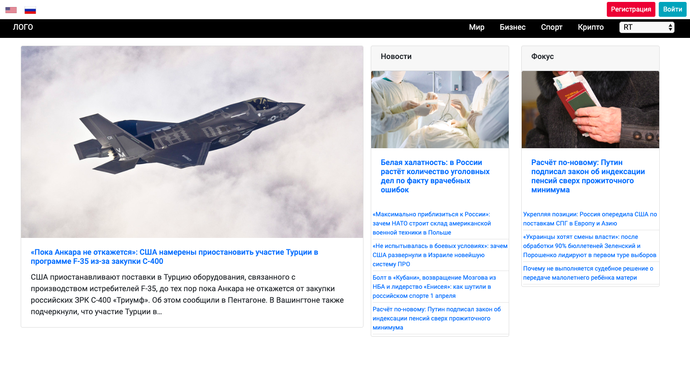
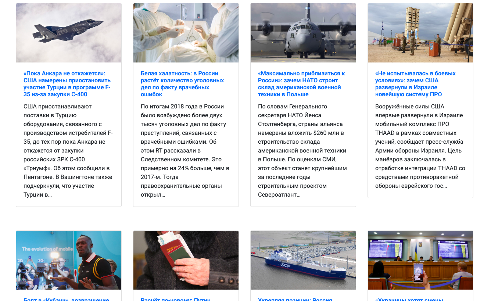
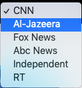
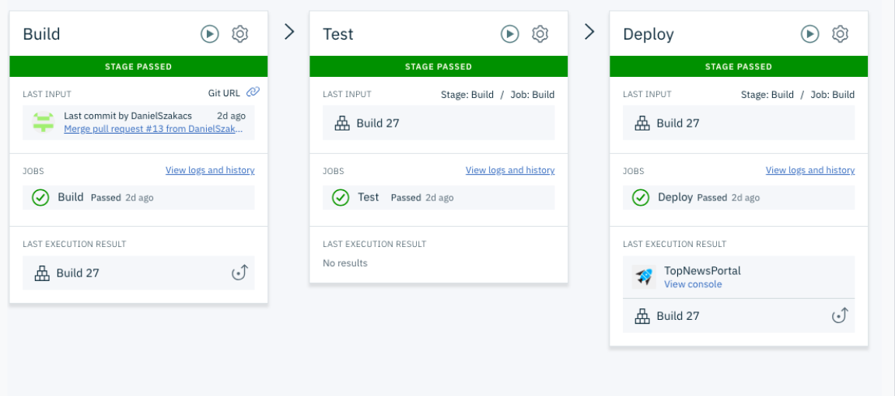

# Top News Portal

This is my first pet project and it's still under developing. On this news portal, you can read the latest news from the top channels(CNN, RT, BBC, etc).
The page is available in two language English and Russian.

#Technology Stack:
- Spring Boot
- Java 8
- Continuous Deployment 
- Pipeline (DevOps)
- Docker
- Bootstrap
- Angular 7 

#Outlook
To see the project on Heroku, please use this link:    
https://newsportal-petproject-daniel.herokuapp.com/
                                          
                                    
                                   
You can search between multiple channels.       
       
Continuous Deployment pipeline on the IBM cloud     
